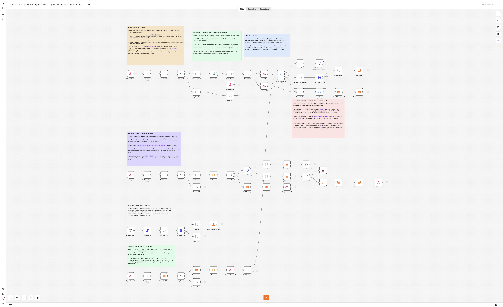
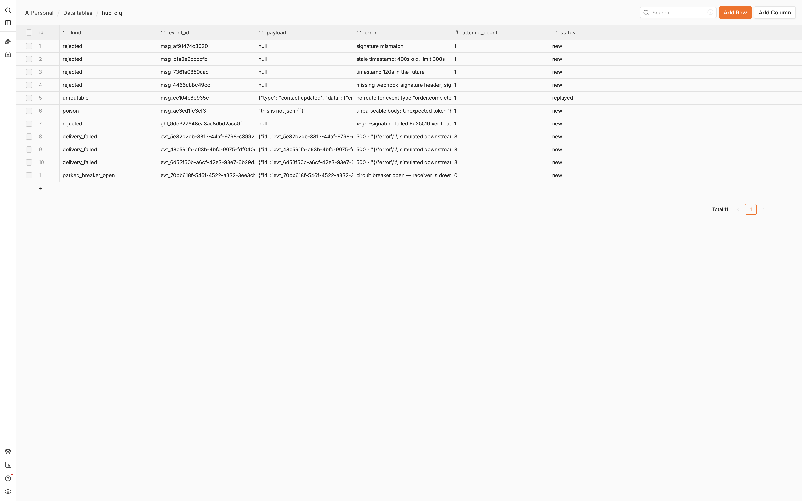
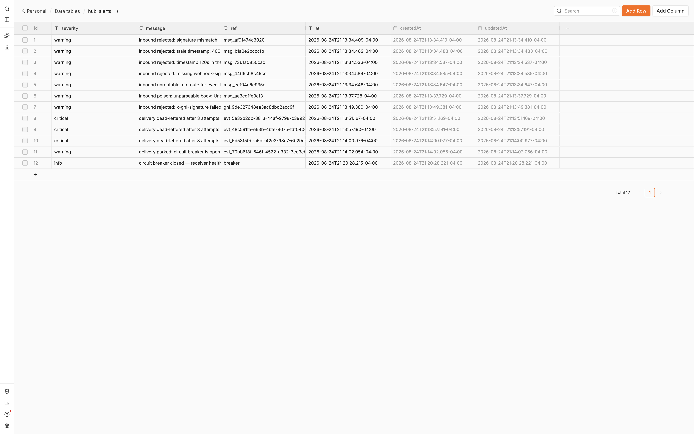
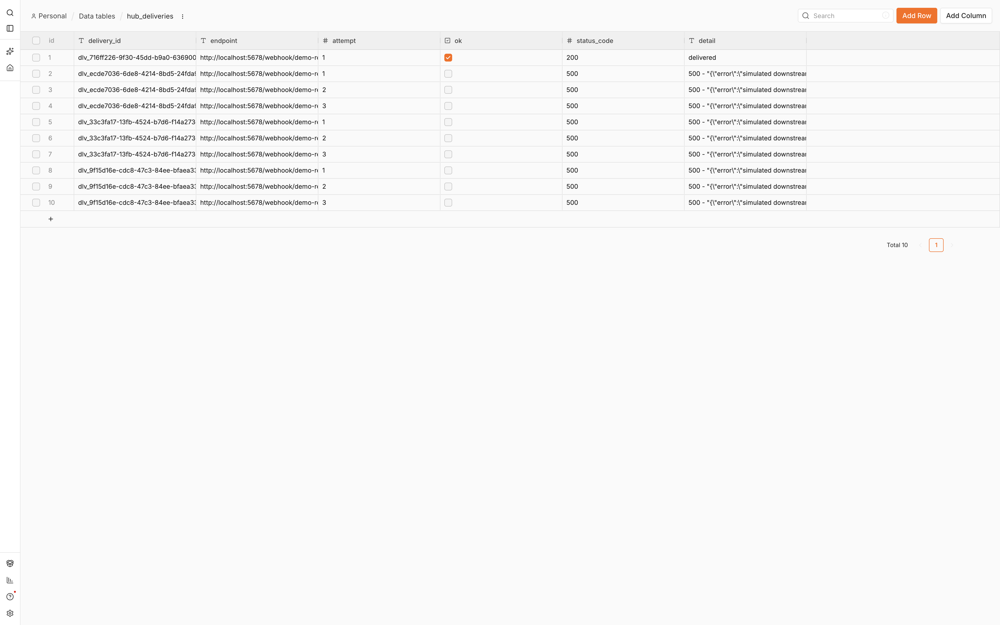

# ghl-webhook-hub

**A signed, idempotent, dead-lettered webhook integration hub for GoHighLevel, built in n8n — with an 18-case contract test suite that proves every claim over the wire.**

Most webhook integrations are a URL and a prayer. Of 685 webhook-triggered workflows in a 4,430-workflow n8n template corpus I mined before building this: 18.1% have *any* error handling, 8.2% use *any* authentication, and **0 build a dead-letter path**. This hub is the opposite — the unhappy path is the product.



## Why this exists right now

GoHighLevel is retiring its legacy RSA webhook signature: per the official [Webhook Integration Guide](https://marketplace.gohighlevel.com/docs/webhook/WebhookIntegrationGuide/index.html), **the `X-WH-Signature` header is deprecated on September 1, 2026**, replaced by `X-GHL-Signature` — an Ed25519 signature over the raw request body, verified against GHL's published public key. Any integration still verifying only the legacy header stops being verifiable after that date.

This hub already verifies the new scheme.

## What it does

**Inbound** (`POST /webhook/hub/inbound`) — two verification lanes:

- **GoHighLevel marketplace deliveries:** `X-GHL-Signature`, Ed25519 over the raw body, checked against a configurable public-key list (GHL's official key first — key lists make zero-downtime rotation possible). GHL's signature carries no timestamp, so replay defence on this lane is event-id dedupe — scoped honestly, not hand-waved.
- **Everything else:** the [Standard Webhooks](https://github.com/standard-webhooks/standard-webhooks) scheme — HMAC-SHA256 over `{webhook-id}.{webhook-timestamp}.{raw body}`, base64, `v1,` prefix, **timing-safe compare**, ±300s timestamp tolerance (Stripe's library default) plus a future-skew bound. Signature is computed over the **raw bytes** the request arrived with, never a re-serialized parse.

Then, in order: **idempotency reservation** before any side effect (a duplicate delivery gets back the *recorded outcome* of the first — same answer, zero repeated work; dedupe TTL outlives the sender's retry window) → **ack fast** (202 leaves before the CRM write happens; senders retry slow handlers, and that retry manufactures duplicates) → **route by event type** (unknown types dead-letter — the fallback output is wired, because n8n's default silently *drops* unmatched items) → **upsert into GHL** (`POST /contacts/upsert`, keyed on normalized email/full-digit phone, source-stamped; never a blind create, so a replay is a no-op) → event ledger row.

A malformed-but-authentic payload is **acked 200 and dead-lettered, never 500'd**: GHL redelivers non-2xx responses up to 12 times, so refusing a poison message just means twelve more copies of it.

**Outbound** (`POST /webhook/hub/emit`):

- A **versioned event catalog** enforced at the edge — unknown types get a 422 naming the catalog, they don't surprise a consumer downstream.
- Envelopes are **signed with the same Standard Webhooks scheme the inbound lane verifies** — the hub holds itself to the standard it enforces on others.
- A **retry ladder with full jitter** — `sleep = random(0, min(cap, base·2^attempt))`, bounded at 3 attempts, every attempt logged. Hand-built, because n8n's native retry is clamped to 5 tries × 5s *fixed* wait (`n8n-core/…/workflow-execute.js`), and is **silently disabled** the moment a node's On Error is set to a Continue option — a bug 164 nodes in the public corpus ship without knowing it.
- A **circuit breaker** (closed / open / half-open): three consecutive dead-lettered deliveries open it; an open breaker parks deliveries with *zero* attempts; a scheduled probe re-tests the receiver's health after cooldown and closes it — self-healing, no human required.

**Dead letters + replay** (`POST /webhook/hub/replay`):

- Every failure lands in a native n8n Data Table with the full sanitized payload, error, attempt count, and a **status lifecycle**: `new → fixed → replayed`.
- Replay only touches rows a human marked `fixed` — **root cause first, then replay**, or you re-poison the flow with the same failure.
- Replayed inbound events re-enter at the router and travel the normal path. No side doors.
- A **shared error workflow** (`Error Trigger`) catches anything unexpected across all three workflows and writes it to the same DLQ — including trigger-node failures, which arrive with a different payload shape and no execution id.
- Credentials can never land in the log: an n8n Guardrails node (`secretKeys`, deterministic — no model attached) scrubs every payload before it's stored. Deliberately *not* PII-scrubbing: emails and phones are the CRM's own data, and redacting them would make dead letters unreplayable. That trade-off is written on the canvas where a reviewer can disagree with it.



## The proof

`tools/test_webhook_hub.py` fires 18 contract cases at the running hub and asserts on **stored table state over REST**, not just HTTP responses:

| # | Case | Expects |
|---|---|---|
| 1 | valid signed event | 202 accepted |
| 2 | the same delivery again | 200 + the recorded outcome of the first |
| 3 | stored state for the pair | exactly ONE processed event row |
| 4 | tampered body | 401 |
| 5 | stale timestamp (400s) | 401 |
| 6 | future timestamp (+120s) | 401 |
| 7 | missing signature | 401 |
| 8 | authentic but unroutable type | 202 + DLQ row `unroutable` |
| 9 | authentic garbage (poison) | 200 ack + DLQ row, never a 5xx |
| 10 | emit to healthy receiver | delivered on attempt 1 |
| 11 | replay with nothing fixed | `replayed: 0` |
| 12 | fix the DLQ row, replay | processed via the normal path + marked `replayed` |
| 13 | emit unknown type | 422 with the catalog |
| 14 | valid `X-GHL-Signature` (Ed25519) | 202 + processed |
| 15 | tampered body on the GHL lane | 401 |
| 16 | failing receiver ×3 | 3 bounded jittered attempts each, then dead-lettered |
| 17 | third consecutive dead-letter | trips the breaker |
| 18 | emit while breaker open | parked with ZERO attempts (503) |

**18/18 passing.** The suite deliberately ends with the breaker open; minutes later the probe lane closes it on its own — the alert log below is one unedited incident story, ending in the self-heal:





## The chaos test — receiver death mid-delivery

The contract suite proves each mechanism in isolation. `tools/chaos_receiver_death.py` proves they compose under real failure: a batch of 20 outbound events, and the receiving system **dies partway through the batch** (its workflow is deactivated — endpoints return 404, exactly like a crashed service; not a simulated-error payload).

What has to happen, and is asserted on stored table state end to end:

1. Events 01–10 deliver on attempt 1 while the receiver is healthy.
2. The receiver dies. Events 11–13 each run the full 3-attempt jittered ladder (every 404 logged to `hub_deliveries`) and dead-letter; the third dead letter **trips the circuit breaker**.
3. Events 14–20 are **parked with zero attempts** (503) — the breaker refuses to hammer a dead dependency. All 10 outage events are caught in `hub_dlq`, each exactly once.
4. The receiver comes back. Nobody touches the hub: the probe lane notices on its own schedule and **closes the breaker** (the `circuit breaker closed` alert row is the assertion).
5. Every dead letter is triaged `fixed` and re-emitted through `/hub/emit` — fresh envelope, fresh signature, fresh ladder — then marked `replayed`.
6. The ledger must balance exactly: **delivered(10) + drained(10) == 20, zero lost, zero duplicated** — one successful-delivery row per event across the whole incident, zero DLQ rows left `new`/`fixed`, and the inbound event ledger untouched.

```bash
python3 tools/chaos_receiver_death.py   # n8n up, hub + receiver active
```

Exit 0 only if the ledger balances and the DLQ drains to zero. The kill lands between delivery 10 and 11 of the batch — emits are synchronous, so "mid-delivery" for a sequential batch means mid-batch, stated honestly.

## Run it

Requirements: self-hosted n8n ≥ 2.35 with Data Tables, Node 18+, Python 3.9+.

```bash
# 1. n8n must allow the crypto builtin in Code nodes (signature verification):
export NODE_FUNCTION_ALLOW_BUILTIN=crypto
n8n start

# 2. generate, provision the four data tables, import all three workflows:
export N8N_EMAIL=you@example.com N8N_PASSWORD=... GHL_LOCATION_ID=...
python3 tools/build_webhook_hub.py --provision --import
# restart n8n so the imported webhooks register

# 3. prove it:
python3 tools/test_webhook_hub.py
```

The generator is the source of truth — the canvas is never hand-edited. It also refuses to build anything unverifiable: it mechanically asserts that every CRM write has its error output **wired**, that retries are bounded, that the dedupe reservation sits upstream of every side effect, that no node overlaps another on the canvas, and that no credential-shaped literal exists in the emitted JSON.

`tools/demo-ed25519.json` is a demo keypair standing in for GoHighLevel's signer in local tests (GHL holds the real private key); the config carries GHL's official public key first, so pointing real marketplace deliveries at the hub needs no changes.

## Honest limits

- This is a single-instance demo: the idempotency reservation uses workflow static data (with the durable ledger in a Data Table). Horizontal scale moves the reservation to Redis/Postgres.
- The demo ladder is compressed (seconds, 3 attempts) so a full failure story fits in one execution log; a production ladder stretches the same machinery toward Svix's published schedule (8 attempts over ~28h).
- GHL's `tags` field on upsert **overwrites** the contact's whole tag list — a production deployment fetches and merges before tagging. Documented rather than hidden.

## Where the corpus numbers come from

`tools/webhook_corpus_stats.py` is the miner that produced the headline statistics — a scripted walk over 4,430 parseable workflows from the public n8n template corpus (awesome-n8n-workflows, n8n-workflow-templates, awesome-n8n-templates). A workflow counts as webhook-triggered only if it *contains an actual Webhook node* — filename matching inflates the count nearly 3x. The numbers were independently re-verified by a second, differently-implemented count before being quoted anywhere:

| Statistic | Count |
|---|---|
| Webhook-triggered workflows | 685 / 4,430 (15.5%) |
| …with ANY error handling | 124 (18.1%) |
| …with any retry | 39 (5.7%) |
| …with any webhook auth | 56 (8.2%) |
| …with an error workflow attached | 6 (0.9%) |
| …with a dead-letter path | **0** |
| …combining signature + freshness + event-id dedupe | **0** |
| …doing a CRM upsert from a webhook | **0** |

## License

MIT — see [LICENSE](LICENSE).
